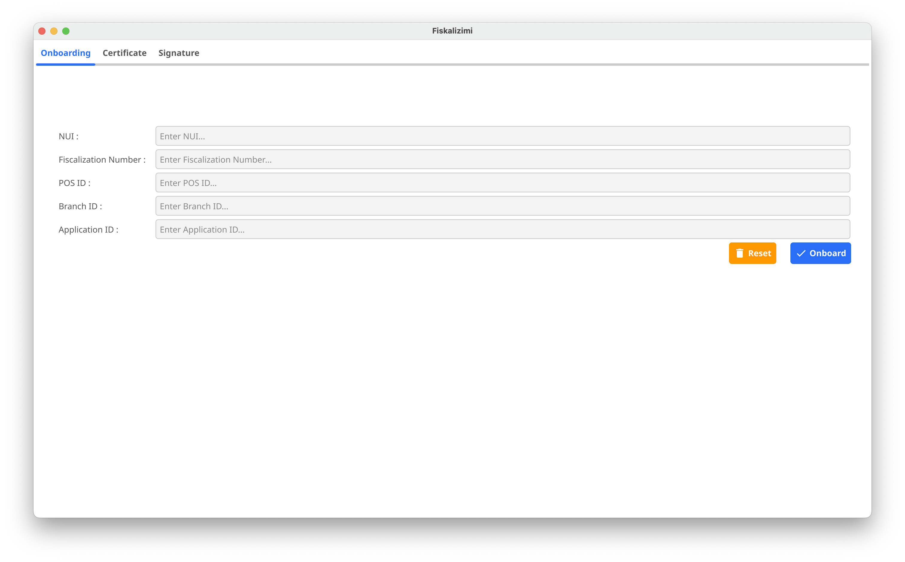
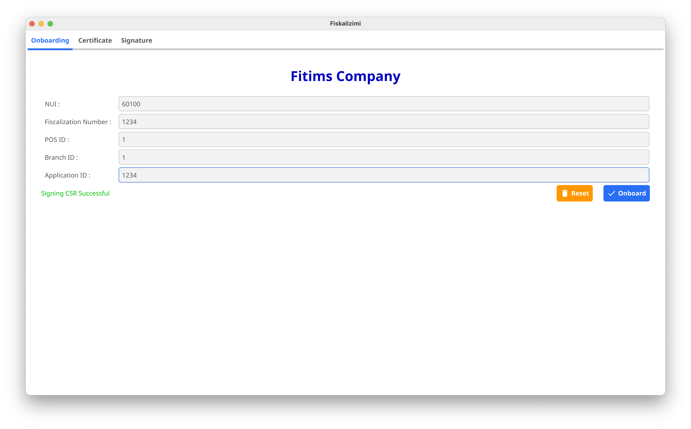
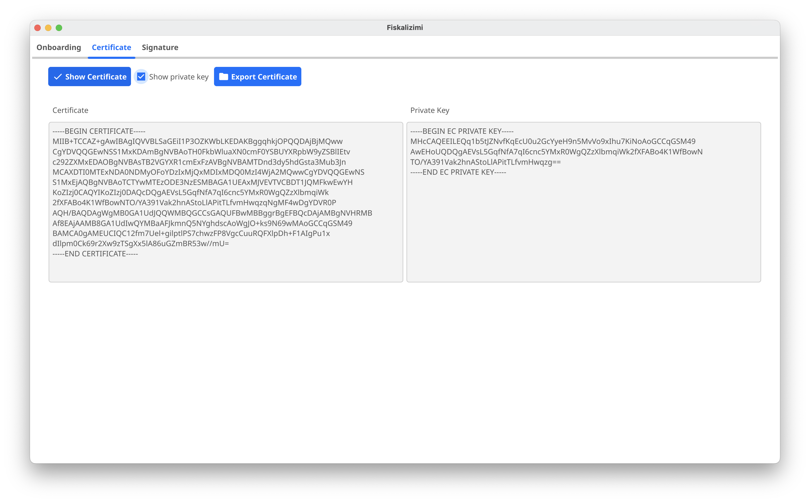

# Fiscalization Integration with PHP using Protobuf #

This repository provides a PHP implementation for integrating with a fiscalization system using classes generated by Protobuf. The process includes constructing fiscal receipts (Citizen and POS Coupons), digitally signing them, and submitting them to the fiscalization service. This guide walks you through the steps necessary to integrate and execute the solution.

## Table of Contents ##

- [Project Overview](#project-overview)
- [Getting Started](#getting-started)
    - [Prerequisites](#prerequisites)
    - [Installation](#installation)
- [Generating PROTOBUF models](#generating-protobuf-models)
    - [Manually generating Models](#manually-generating-models)
    - [Let PHP generate models automatically](#let-php-generate-models-automatically)
- [Model Explanation](#model-explanation)
    - [Citizen Coupon](#citizen-coupon)
    - [POS Coupon](#pos-coupon)
- [PKI Key Generation](#key-generation)
- [Digital Signing](#digital-signing)
    - [Steps to generate digital signature](#steps-to-generate-digital-signature)
    - [QR Code generation](#qr-code)
- [Sending Data to Fiscalization Service](#sending-data-to-fiscalization-service)
    - [Sending Citizen Coupons](#sending-citizen-coupons)
    - [Sending POS Coupons](#sending-pos-coupons)
- [Running the Application](#running-the-application)

## Project Overview ##

This project provides a set of PHP classes to interact with a fiscalization system. The key components include:

1. **Models**: This is the models generated by Protobuf
2. **ModelBuilder**: Constructs the Citizen and POS coupons (receipts) using predefined tax groups, items, and payment methods.
3. **Signer**: Signs the receipts using a digital signature created with an ECDSA private key.
4. **Fiskalizimi**: Contains methods for constructing, signing, and sending fiscal coupons to the fiscalization service.

### Key Technologies: ###
- **Protobuf**: Used for serializing the data models (CitizenCoupon, PosCoupon) to binary.
- **ECDSA**: Elliptic curve algorithm used for digital signatures.
- **HttpClient**: For sending data to the fiscalization service.

## Getting Started

### Prerequisites

Before integrating the system, ensure you have the following installed:

- [PHP 7.4+ (or 8.x)](https://www.php.net/downloads.php)
- [Protobuf Compiler](https://github.com/protocolbuffers/protobuf/releases)
- A valid [ECDSA private key](#key-generation) for signing the data.
- (Recommended) [Composer](https://getcomposer.org/) for dependency management, including
    google/protobuf or grpc/grpc (if needed for Protobuf in PHP).
    guzzlehttp/guzzle for HTTP requests.

### Installation

1. Navigate to you project and Install dependencies (example using Composer)::
   ```bash
   composer require google/protobuf guzzlehttp/guzzle
   ```

## Generating PROTOBUF models ##

### Let PHP generate models automatically

Unlike .NET (which can generate code at build time), in PHP you typically generate Protobuf classes ahead of time using protoc or in some CI/CD pipeline. Automatic runtime generation is less common in PHP.

Once you have the generated PHP classes (e.g., ```CitizenCoupon.php```, ```PosCoupon.php```, etc.), you can include them in your code via Composer autoload or manual ```require_once```.

Here are the steps to generate Protobuf models:

1. **Add the .proto file to your project:** Place your ```.proto``` file (in our case ```models.proto```) inside your project directory, usually in a ```Protos``` folder for organization. In the ```.php``` file, reference the ```.proto``` file to instruct the compiler to generate the necessary PHP classes.
3. **Modify your .php file** to include Protobuf file generation instructions:
   ```
   <ItemGroup>
       <Protobuf Include="Protos/models.proto" GrpcServices="None" />
   </ItemGroup>
   ```
   Setting ```GrpcServices="None"``` ensures that only data models are generated, without gRPC service code, since we are only interested in the models (e.g., ```PosCoupon```, ```CitizenCoupon```, ```Payment```, etc.).
4. **Build the project:** Run the following command to compile the ```.proto``` file and generate the PHP classes:
   ```
   dotnet build
   ``` 
   This will automatically generate PHP classes that correspond to the Protobuf messages (like ```PosCoupon```, ```CitizenCoupon```, ```CouponItem```, etc.) in your ```.proto``` file.

## Model Explanation ##

### Citizen Coupon ###

The ```CitizenCoupon``` represents a simplified receipt that will be the part of QR Code. Below is the example structure created by the [```ModelBuilder``` class](fiskalizimi/ModelBuilder.cs):

```
use Protos\CitizenCoupon;
use Protos\CouponType;
use Protos\TaxGroup;

function getCitizenCoupon(): CitizenCoupon
{
    $coupon = new CitizenCoupon();
    $coupon->setBusinessId(1);
    $coupon->setPosId(1);
    $coupon->setCouponId(1234);
    $coupon->setType(CouponType::SALE); // or RETURN / CANCEL
    // Unix time for 2024-10-01 15:30:20 UTC
    $coupon->setTime(mktime(15, 30, 20, 10, 1, 2024)); 
    $coupon->setTotal(1820);

    // Add tax groups
    $tg1 = new TaxGroup();
    $tg1->setTaxRate("C");
    $tg1->setTotalForTax(450);
    $tg1->setTotalTax(0);

    $tg2 = new TaxGroup();
    $tg2->setTaxRate("D");
    $tg2->setTotalForTax(320);
    $tg2->setTotalTax(26);

    $tg3 = new TaxGroup();
    $tg3->setTaxRate("E");
    $tg3->setTotalForTax(1850);
    $tg3->setTotalTax(189);

    // Protobuf repeated fields can be appended in various ways
    $coupon->setTaxGroups([$tg1, $tg2, $tg3]);
    $coupon->setTotalTax(215);

    return $coupon;
}

```

The Citizen Coupon includes:

* **BusinessId** which is NUI of the business (received from ATK)
* **PosId** is the unique id of the POS. POS is the computer/till that has the POS system installed. Each POS unit must have a unique ID.
* **CouponId** is the unique identifier of the fiscal coupon generated by POS system
* **Type** this is the type of the coupon. It is an enum value and can be ```SALE```, ```RETURN``` or ```CANCEL```
* **Time** the time fiscal coupon is issued. The value is Unix timestamp
* **Total** that represents the total value to be paid by customer
* **TaxGroups** is an array of ```TaxGroup``` objects. Each ```TaxGroup``` object represents the details about tax category
* **TotalTax** is the amount of the tax in total that customer will have to pay

**NOTE:** These details must match the [POS Coupon](#pos-coupon) details, otherwise the coupon will be marked as ```FAILED VERIFICATION``` !


### POS Coupon ###

The PosCoupon includes all details of the POS Coupon that will be printed and given to the customer located in [```ModelBuilder``` class](fiskalizimi/ModelBuilder.cs)

```
use Protos\PosCoupon;
use Protos\CouponItem;
use Protos\CouponType;
use Protos\Payment;
use Protos\PaymentType;
use Protos\TaxGroup;

function getPosCoupon(): PosCoupon
{
    $posCoupon = new PosCoupon();
    $posCoupon->setBusinessId(1);
    $posCoupon->setPosId(1);
    $posCoupon->setCouponId(1234);
    $posCoupon->setBranchId(3);
    $posCoupon->setLocation("Prishtine");
    $posCoupon->setOperatorId("Kushtrimi");
    $posCoupon->setApplicationId(1);
    $posCoupon->setVerificationNo("1234567890123456");
    $posCoupon->setType(CouponType::SALE);
    $posCoupon->setTime(mktime(15, 30, 20, 10, 1, 2024));

    // Items
    $item1 = new CouponItem();
    $item1->setName("uje rugove");
    $item1->setPrice(150);
    $item1->setUnit("cope");
    $item1->setQuantity(3);
    $item1->setTotal(450);
    $item1->setTaxRate("C");
    $item1->setType("TT");

    $item2 = new CouponItem();
    $item2->setName("sendviq");
    $item2->setPrice(300);
    $item2->setUnit("cope");
    $item2->setQuantity(2);
    $item2->setTotal(600);
    $item2->setTaxRate("E");
    $item2->setType("TT");

    $item3 = new CouponItem();
    $item3->setName("buke");
    $item3->setPrice(80);
    $item3->setUnit("cope");
    $item3->setQuantity(4);
    $item3->setTotal(320);
    $item3->setTaxRate("D");
    $item3->setType("TT");

    $item4 = new CouponItem();
    $item4->setName("machiato e madhe");
    $item4->setPrice(150);
    $item4->setUnit("cope");
    $item4->setQuantity(3);
    $item4->setTotal(450);
    $item4->setTaxRate("E");
    $item4->setType("TT");

    $posCoupon->setItems([$item1, $item2, $item3, $item4]);

    // Payments
    $p1 = new Payment();
    $p1->setType(PaymentType::CASH);
    $p1->setAmount(500);

    $p2 = new Payment();
    $p2->setType(PaymentType::CREDIT_CARD);
    $p2->setAmount(1000);

    $p3 = new Payment();
    $p3->setType(PaymentType::VOUCHER);
    $p3->setAmount(320);

    $posCoupon->setPayments([$p1, $p2, $p3]);
    $posCoupon->setTotal(1820);

    // Tax groups
    $tgC = new TaxGroup();
    $tgC->setTaxRate("C");
    $tgC->setTotalForTax(450);
    $tgC->setTotalTax(0);

    $tgD = new TaxGroup();
    $tgD->setTaxRate("D");
    $tgD->setTotalForTax(320);
    $tgD->setTotalTax(26);

    $tgE = new TaxGroup();
    $tgE->setTaxRate("E");
    $tgE->setTotalForTax(1850);
    $tgE->setTotalTax(189);

    $posCoupon->setTaxGroups([$tgC, $tgD, $tgE]);
    $posCoupon->setTotalTax(215);
    $posCoupon->setTotalNoTax(1605);

    return $posCoupon;
}

```

The POS Coupon includes:

* **BusinessId** which is NUI of the business (received from ATK)
* **PosId** is the unique id of the POS. POS is the computer/till that has the POS system installed. Each POS unit must have a unique ID.
* **CouponId** is the unique identifier of the fiscal coupon generated by POS system. CouponId has to be unique for Business (across all branches)
* **BranchId** is the branch id.
* **Location** is the location/city of the Sale Point
* **OperatorId** is the ID/Name of the operator/server
* **ApplicationId** is the unique ID of the Application/POS System used. This code is provided by the Software provider that has implemented the POS Solution.
* **VerificationNo** is a unique value for each coupon, and it is 16 characters long max. Verification Number is used to check if the Coupon has been verified by the citizen.
* **Type** this is the type of the coupon. It is an enum value and can be ```SALE```, ```RETURN``` or ```CANCEL```
* **Time** the time fiscal coupon is issued. The value is Unix timestamp
* **Items** is an array of ```CouponItem``` objects. Each ```CouponItem``` represents an item sold to the customer.
* **Payments** is an array of ```Payment``` that represent the types of the payment methods and the amoun used by customer to pay for the goods. The valid types are: ```Cash```, ```CreditCard```, ```Voucher```, ```Cheque```, ```CryptoCurrency```, and ```Other```.
* **Total** that represents the total value to be paid by customer
* **TaxGroups** is an array of ```TaxGroup``` objects. Each ```TaxGroup``` object represents the details about tax category
* **TotalTax** is the amount of the tax in total that customer will have to pay
* **TotalNoTax** is the total amount without tax that customer will have to pay

**NOTE:** These details must match the [Citizen Coupon](#citizen-coupon) details, otherwise the coupon will be marked as ```FAILED VERIFICATION``` !

## Key Generation ##

There are different ways to generate a PKI key pair, depending on the operating system.

**WARNING!** Each POS system (PC/till) needs to have a unique ID and its own PKI key pair. The private key should never leave the machine that it is generated on !!!

We have provided a tool that simplifies the process a lot by creating the key pair, generating a CSR and sending the CSR to ATK Certificate Authority to be digitally signed and verified.

If you have cloned this repository the tool for different operating systems is located under the folder ```onbarding``` or, alternatively to download the tool on you machine, click on one of the links below (depending on the operating system you are using):

* [onboarder for windows](https://github.com/fiskalizimi/pos-golang/raw/refs/heads/main/onboarder/onboarder-windows.zip)
* [onboarder for MacOS](https://github.com/fiskalizimi/pos-golang/raw/refs/heads/main/onboarder/onboarder-macos.zip)
* [onboarder for Linux](https://github.com/fiskalizimi/pos-golang/raw/refs/heads/main/onboarder/onboarder-linux.zip)

To onboard your business, you need the following information:

1. NUI of the business
2. Fiscalization Number - (this is obtained from EDI)
3. Pos ID - each POS should have a unique ID which is a numeric value
4. Branch ID

Once you have downloaded the onboarder tool, and extracted/unzipped it to a folder, then you need to run the application.
You need to provide an environment flag as an argument to the executable. For testing purposes the environment value should be ```TEST```, and for production the environment value should be ```PROD```

For example

On Windows Platform you need to open a command prompt then execute the application like the example below:
```shell
onboarder.exe -env=TEST
```

On linux/macos you need to open a terminal and then exeucte the application like the example below:
```shell
./onboarder -env=PROD
```



if everything went Ok, then you will get a success message:




To view certificate and private key in PEM format, on the **Certificate** tab, first tick the **Show private key** checkbox, then click on the **Show Certificate** button:



To extract certificate and private key in PEM format, on the **Certificate** tab, first tick the **Show private key** checkbox, then click on the **Export Certificate** button.
This action will create another two files in the folder ```private-key.pem``` and ```signed-certificate.pem```

**WARNING !** Make sure to keep private key safe.

## Digital Signing ##

Before the data is sent to the Fiscalization System, the POS Coupon details need to be digitally signed using the private key to ensure the authenticity and integrity of the data transmitted to the fiscalization system.

#### Why Digital Signing? ####

The fiscalization system requires each coupon to be signed digitally before submission to ensure:

1. **Data Integrity:** Ensures that the data sent to the fiscalization service has not been tampered with during transmission.
3. **Authentication:** Confirms that the coupon is issued by a legitimate entity (in this case, your business), preventing fraudulent submissions.
3. **Non-Repudiation:** Guarantees that the sender cannot deny sending the data once it has been signed and submitted.

The digital signature is generated using a private key, and the fiscalization service verifies the signature using a corresponding public key. If the signature is valid, the coupon is considered authentic.

### Steps to generate digital signature ###

The steps to provide a valid signature are:

1. **Serialization:** First, the coupon (either a Citizen or POS coupon) is serialized into a Protobuf binary format. This format ensures that the data can be transmitted efficiently and consistently.
   ```
   byte[] posCouponProto = posCoupon.ToByteArray();
   ```
2. **Base64 Encoding:** The serialized Protobuf binary data is then encoded into a Base64 string. Base64 is a binary-to-text encoding scheme that makes it easy to transfer data as a string format.
   ```
   var base64EncodedProto = Convert.ToBase64String(posCouponProto);
   ```
3. **Hashing:** Before signing, the data is hashed using a SHA-256 cryptographic hash function. Hashing converts the coupon data into a fixed-length string of bytes, ensuring that even a small change in the original data will produce a completely different hash value.
   ```
   var sha256 = SHA256.Create();
   var hash = sha256.ComputeHash(base64EncodedProto);
   ```
4. **Signature Creation:** The hash is then signed using the ECDSA private key. This generates a digital signature, which is unique to the data and the private key. The fiscalization system can later verify this signature using the corresponding public key.
   ```
   var ecdsa = ECDsa.Create();
   ecdsa.ImportFromPem(_key);  // Load the private key
   var signature = ecdsa.SignHash(hash);
   ```
5. **Base64 Signature:** The generated signature is then encoded into a Base64 string, which makes it easy to include in the final request to the fiscalization service.
   ```
   var encodedSignature = Convert.ToBase64String(signature);
   ```

The [Signer class](fiskalizimi/Signer.cs) digitally signs both Citizen and POS coupons using the **ECDSA** algorithm. A private key is loaded and used to create a signature over the serialized coupon data.

```
public string SignBytes(byte[] data)
{
    var ecdsa = ECDsa.Create();
    ecdsa.ImportFromPem(_key);
    var hash = SHA256.Create().ComputeHash(data);
    var signature = ecdsa.SignHash(hash);
    return Convert.ToBase64String(signature);
}
```

The return value is a **base64-encoded** signature.

### QR Code ###

Printed fiscal coupon needs to also have a QR Code that can be scanned by citizens to verify the authenticity of the receipt.

In the Fiscalization System, QR codes are generated based on the serialized and signed data of a Citizen Coupon. The data, once encoded into a QR code, is typically printed on the customer receipt.

#### QR Code Data Structure ####

In this implementation, the QR code contains:

1. The **Base64-encoded** serialized data of the [Citizen Coupon](#citizen-coupon).
2. The **Base64-encoded** digital signature of that data.

These two parts are combined into a single string, separated by a pipe | symbol, which forms the data to be encoded in the QR code.

#### QR Code Generation in Code ####

The following steps show how the QR code data is generated in the ```Fiskalizimi``` class using the ```CitizenCoupon``` model.

1. **Serialize the CitizenCoupon to Protobuf binary:** This ensures that the receipt data is in a compact binary format.
   ```
   byte[] citizenCouponProto = citizenCoupon.ToByteArray();
   ```
2. **Base64 encode the Protobuf data:** This converts the binary data into a Base64-encoded string, making it suitable for use in the QR code.
   ```
   var base64EncodedProto = Convert.ToBase64String(citizenCouponProto);
   ```
3. **Generate a digital signature:** Using the ECDSA private key, sign the Base64-encoded Protobuf data to ensure its authenticity and integrity.
   ```
   var base64EncodedBytes = Encoding.UTF8.GetBytes(base64EncodedProto);
   string signature = signer.SignBytes(base64EncodedBytes);
   ```
4. **Combine the data and signature:** The Base64-encoded coupon data and the Base64-encoded signature are concatenated with a pipe | symbol to form the final string, which will be encoded into a QR code.
   ```
   string qrCodeString = $"{base64EncodedProto}|{signature}";
   ```
5. **Print or display the QR code:** The resulting qrCodeString can now be encoded into a QR code and printed on the receipt or displayed on a screen.


Below is the method in the [Fiskalizimi class](fiskalizimi/Program.cs) that generates the QR code string for a Coupon:

```
  private function signData($data)
    {
        $privateKey = openssl_pkey_get_private(file_get_contents('private_key.pem'));
        if (!$privateKey) {
            throw new Exception('Error loading private key.');
        }
        openssl_sign($data, $signature, $privateKey, OPENSSL_ALGO_SHA256);
        return base64_encode($signature);
    }

```


## Sending Data to Fiscalization Service ##

### Sending Citizen Coupons ###

QR Code will be scanned by the Citizen Mobile App, which in turn will send the data to the Fiscalization System for verification.
This method mimics the Citizen Mobile App, and is used for testing purposes. The [SendQrCode method](fiskalizimi/Program.cs) sends the serialized and signed citizen coupon to the fiscalization service.

This is how you prepare and submit the request:

```
public static async Task SendQrCode()
{
    var builder = new ModelBuilder();
    var signer = new Signer(PrivateKeyPem);
    var citizenCoupon = builder.GetCitizenCoupon();
    var qrCode = SignCitizenCoupon(citizenCoupon, signer);

    var request = new { citizen_id = 1, qr_code = qrCode };
    var response = await new HttpClient().PostAsJsonAsync(url, request);
    response.EnsureSuccessStatusCode();
}
```

### Sending POS Coupons ###


```
 function sendPosCoupon(string $fiscalServiceUrl, string $privateKeyPem): void
{
    $posCoupon = getPosCoupon();

    // 1. Serialize to binary, then base64
    $binaryData = $posCoupon->serializeToString();
    $base64Encoded = base64_encode($binaryData);

    // 2. Sign
    $signature = signData($base64Encoded, $privateKeyPem);

    // 3. Build request
    $payload = [
        'details'   => $base64Encoded,  // The coupon data
        'signature' => $signature
    ];

    // 4. Send
    $client = new Client();
    $response = $client->post($fiscalServiceUrl . '/pos-coupon', [
        'json' => $payload
    ]);

    if ($response->getStatusCode() !== 200) {
        throw new \Exception("POS coupon submission failed");
    }

    echo "POS coupon sent successfully!\n";
}

```

## Running the Application ##

1.Make sure you have a valid ECDSA private key.
2.Update your code with the correct endpoint ($fiscalServiceUrl).
3.Run your PHP script (for example, app.php):

To execute the program and send the coupons:
```
php app.php

```


## Sample `app.php`: ##

```

<?php

require __DIR__ . '/vendor/autoload.php';

// Replace with your private key PEM
$PRIVATE_KEY_PEM = file_get_contents(__DIR__ . '/private-key.pem');

// Replace with the actual service URL
$FISCAL_SERVICE_URL = 'https://api.fiscalization.example';

try {
    // Send Citizen Coupon
    sendQrCode($FISCAL_SERVICE_URL, $PRIVATE_KEY_PEM);

    // Send POS Coupon
    sendPosCoupon($FISCAL_SERVICE_URL, $PRIVATE_KEY_PEM);

} catch (\Exception $ex) {
    echo "Error: " . $ex->getMessage();
}


```


### Summary


1.***Generate your Protobuf-based models*** (CitizenCoupon, PosCoupon, etc.).<br />
2.***Build each coupon*** (filling out required fields).<br />
3.***Serialize to binary and then to Base64***.<br />
4.***Sign using your ECDSA private key***.<br />
5.***Send the data (and signature) to the fiscalization service***.<br />
6.***Embed the Citizen Coupon data in a QR code for receipts***.<br />

Disclaimer: Security aspects like storing private keys, handling concurrency, using ext-openssl for ECDSA, or verifying chain-of-trust are beyond the scope of this example. Always follow best practices for cryptographic operations and key management in production.